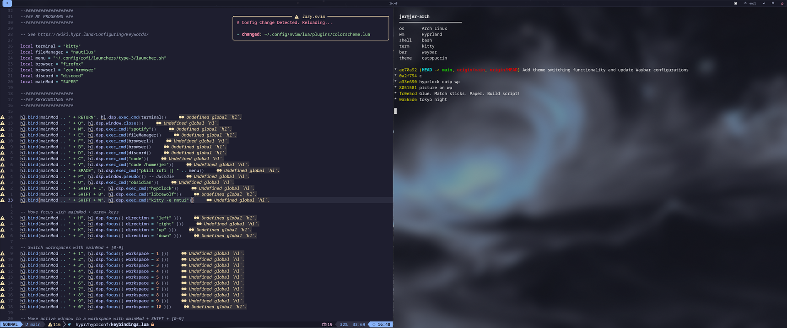
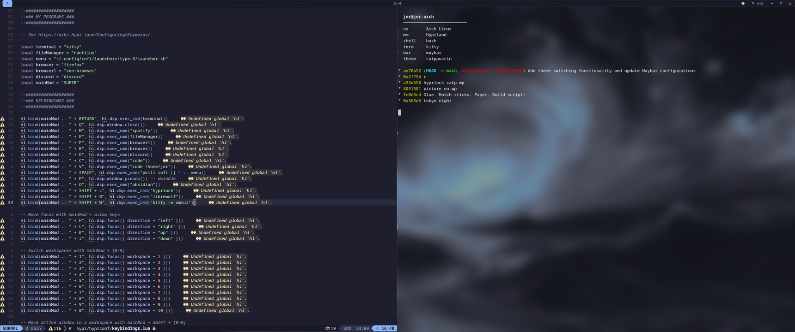
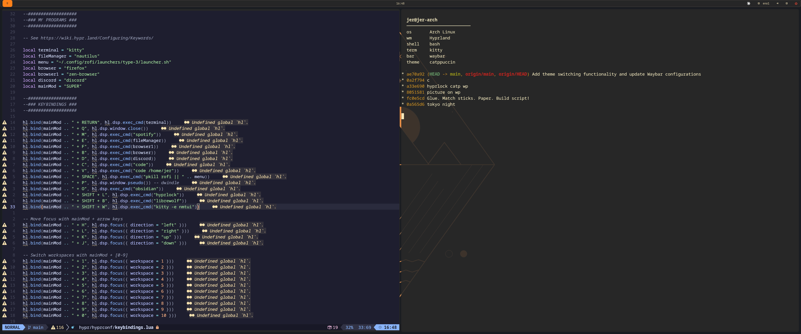
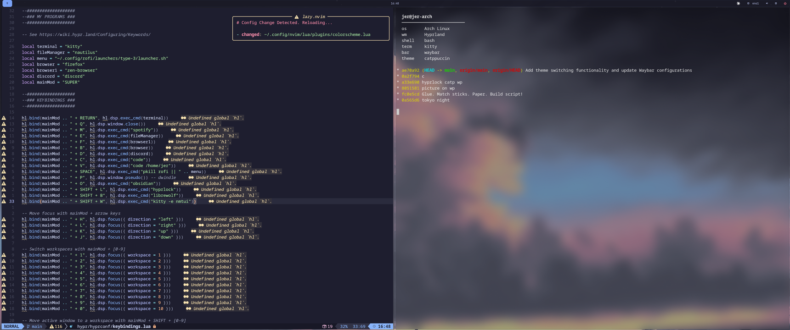
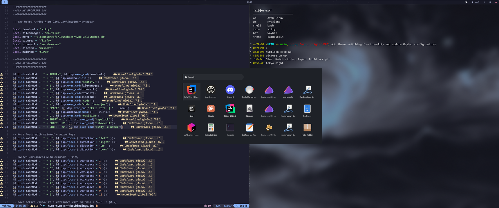
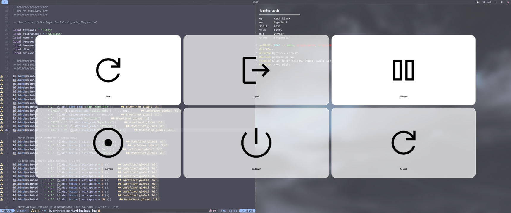

<div align="center">

# HiraDotfiles

**A clean, themeable Hyprland setup for Arch Linux.**

Hyprland (Lua config) · Waybar · Rofi · Kitty · wlogout · Hyprlock — with one-keystroke theme switching across the whole desktop.

<a href="#-screenshots"></a>
<a href="#-installation"></a>
<a href="#-theming"></a>
<a href="#-license"></a>



</div>

---

## 📑 Table of contents

- [Screenshots](#-screenshots)
- [Features](#-features)
- [What's inside](#-whats-inside)
- [Installation](#-installation)
- [Theming](#-theming)
- [Keybindings](#-keybindings)
- [Repository layout](#-repository-layout)
- [Credits](#-credits)
- [License](#-license)

---

## 📸 Screenshots

### Themes

| Catppuccin | Gruvbox | Tokyo Night |
|:---:|:---:|:---:|
|  |  |  |
| `SUPER + ALT + 1` | `SUPER + ALT + 2` | `SUPER + ALT + 3` |

### Components

<table>
  <tr>
    <td width="50%"><br><sub><b>Rofi launcher</b> — <code>SUPER + SPACE</code></sub></td>
    <td width="50%"><br><sub><b>Waybar</b> — workspaces, clock, battery, network, audio, power</sub></td>
  </tr>
  <tr>
    <td width="50%"><br><sub><b>Hyprlock</b> — <code>SUPER + SHIFT + L</code></sub></td>
    <td width="50%"><br><sub><b>wlogout</b> — lock / hibernate / logout / reboot / shutdown</sub></td>
  </tr>
</table>

---

## ✨ Features

- **Hyprland configured in Lua** — the config is split into readable modules (`autostart`, `input`, `keybindings`, `lookandfeel`, `workspaces`, …) instead of one monolithic `hyprland.conf`.
- **Three full desktop themes** — Catppuccin, Gruvbox and Tokyo Night, each covering Hyprland, Waybar, Kitty, Hyprlock, the wallpaper and Neovim.
- **Instant theme switching** — one keybind swaps every app's colours and reloads Waybar, Kitty, hyprpaper and Hyprland live, no logout needed.
- **Blur & transparency** — 3-pass blur, translucent Kitty (`background_opacity 0.3`), gapless dwindle layout.
- **A large Rofi collection** — 7 launcher types, 6 power-menu types, applets and 16 colour schemes.
- **Safe installer** — `install.sh` symlinks the repo into `~/.config` and timestamps a backup of anything already there.
- **Laptop-ready** — volume, mic, brightness and media keys bound out of the box.

---

## 📦 What's inside

| Component | Role | Config |
|---|---|---|
| [Hyprland](https://hypr.land) | Wayland compositor | `hypr/hyprland.lua` + `hypr/hyprconf/` |
| [Waybar](https://github.com/Alexays/Waybar) | Status bar | `waybar/config.jsonc`, `waybar/style.css` |
| [Rofi](https://github.com/davatorium/rofi) | App launcher & power menu | `rofi/` |
| [Kitty](https://sw.kovidgoyal.net/kitty/) | Terminal | `kitty/kitty.conf` |
| [wlogout](https://github.com/ArtsyMacaw/wlogout) | Logout menu | `wlogout/` |
| [Hyprlock](https://github.com/hyprwm/hyprlock) | Lock screen | `hypr/hyprlock.conf` |
| [hyprpaper](https://github.com/hyprwm/hyprpaper) | Wallpaper daemon | `hypr/hyprpaper.conf` |

---

## 🚀 Installation

> [!WARNING]
> The installer replaces the matching directories in `~/.config` with symlinks to this repo. Anything already there is moved to `<name>.backup.<timestamp>` first — nothing is deleted, but review the script before running it.

```bash
git clone https://github.com/Hira-shi/HiraDotfiles.git
cd HiraDotfiles
./install.sh
```

Already have the packages, or want to review them yourself? Skip installation and only create the symlinks:

```bash
./install.sh --no-packages
```

### What the installer does

1. Installs `hyprland`, `kitty`, `rofi`, `waybar`, `wlogout`, `pavucontrol` and `pamixer` (supports `pacman`, `apt-get` and `dnf`).
2. Backs up any existing `~/.config/{hypr,waybar,rofi,kitty,wlogout}`.
3. Symlinks each directory of this repo into `~/.config`, so edits to your clone apply immediately.

### Recommended extras

Not installed automatically, but used by the config:

```bash
sudo pacman -S hyprpaper hyprlock playerctl brightnessctl nautilus firefox
```

Fonts: **FiraCode Nerd Font** (terminal) and **Papirus** icons (Rofi).

```bash
sudo pacman -S ttf-firacode-nerd papirus-icon-theme
```

---

## 🎨 Theming

Three themes ship in `hypr/themes/`. Each one bundles a matching `lookandfeel.lua`, `hyprlock.conf`, `kitty.conf` and `hyprpaper.conf`, paired with a Waybar theme in `waybar/themes/`.

| Theme | Keybind | Command |
|---|---|---|
| Catppuccin | `SUPER + ALT + 1` | `~/.config/hypr/scripts/switch-theme.sh catppuccin` |
| Gruvbox | `SUPER + ALT + 2` | `~/.config/hypr/scripts/switch-theme.sh gruvbox` |
| Tokyo Night | `SUPER + ALT + 3` | `~/.config/hypr/scripts/switch-theme.sh tokyonight` |

Switching a theme applies, live:

- the Hyprland look & feel and the wallpaper (hyprpaper restart),
- the Waybar layout and stylesheet (Waybar restart),
- the Kitty colours (`SIGUSR1`, so open terminals update too),
- the Hyprlock background,
- the Neovim colorscheme in `~/.config/nvim/lua/plugins/colorscheme.lua`, if you have one.

### Adding your own theme

1. Create `hypr/themes/<name>/` with `lookandfeel.lua`, `hyprlock.conf`, `kitty.conf` and `hyprpaper.conf`.
2. Create `waybar/themes/<name>/` with `config.jsonc` and `style.css`.
3. Add `<name>` to `VALID_THEMES` in `hypr/scripts/switch-theme.sh`, and (optionally) a `SUPER + ALT + n` bind in `hypr/hyprconf/keybindings.lua`.

Wallpapers live in `hypr/wp/` — drop yours in and point the theme's `hyprpaper.conf` at it.

---

## ⌨️ Keybindings

`SUPER` is the mod key. Full list in [`hypr/hyprconf/keybindings.lua`](hypr/hyprconf/keybindings.lua).

### Applications

| Keybind | Action |
|---|---|
| `SUPER + RETURN` | Terminal (Kitty) |
| `SUPER + SPACE` | App launcher (Rofi) |
| `SUPER + E` | File manager (Nautilus) |
| `SUPER + F` | Zen Browser |
| `SUPER + B` | Firefox |
| `SUPER + SHIFT + B` | LibreWolf |
| `SUPER + C` | VS Code |
| `SUPER + V` | VS Code in `~` |
| `SUPER + D` | Discord |
| `SUPER + M` | Spotify |
| `SUPER + O` | Obsidian |
| `SUPER + SHIFT + W` | `nmtui` (Wi-Fi) |
| `SUPER + SHIFT + L` | Lock screen |

### Windows & workspaces

| Keybind | Action |
|---|---|
| `SUPER + Q` | Close window |
| `SUPER + H/J/K/L` | Move focus (vim directions) |
| `SUPER + P` | Toggle pseudo-tiling |
| `SUPER + 1…0` | Go to workspace 1–10 |
| `SUPER + SHIFT + 1…0` | Move window to workspace 1–10 |
| `SUPER + S` | Toggle scratchpad |
| `SUPER + SHIFT + S` | Move window to scratchpad |
| `SUPER + scroll` | Cycle workspaces |
| `SUPER + LMB` / `RMB` drag | Move / resize window |

### System

| Keybind | Action |
|---|---|
| `XF86Audio Raise/Lower/Mute` | Volume |
| `XF86AudioMicMute` | Mute microphone |
| `XF86MonBrightness Up/Down` | Screen brightness |
| `XF86Audio Play/Next/Prev` | Media control (`playerctl`) |
| `SUPER + ALT + 1/2/3` | Switch theme |

---

## 🗂 Repository layout

```
HiraDotfiles/
├── hypr/
│   ├── hyprland.lua           # entry point: monitors + module loading
│   ├── hyprconf/              # split config modules
│   │   ├── autostart.lua      # waybar, hyprpaper, …
│   │   ├── envvariable.lua    # cursor size, …
│   │   ├── input.lua          # keyboard, touchpad, per-device
│   │   ├── keybindings.lua    # every bind
│   │   ├── lookandfeel.lua    # gaps, blur, shadows, animations
│   │   ├── permissions.lua    # Hyprland permission system
│   │   └── workspaces.lua     # window & workspace rules
│   ├── themes/                # catppuccin · gruvbox · tokyonight
│   ├── scripts/switch-theme.sh
│   ├── hyprlock.conf
│   ├── hyprpaper.conf
│   └── wp/                    # wallpapers
├── waybar/
│   ├── config.jsonc           # active config (overwritten on theme switch)
│   ├── style.css
│   └── themes/                # per-theme config + stylesheet
├── rofi/                      # launchers, power menus, applets, 16 colorschemes
├── kitty/kitty.conf
├── wlogout/
└── install.sh
```

> [!NOTE]
> `waybar/config.jsonc`, `waybar/style.css`, `hypr/hyprconf/lookandfeel.lua`, `hypr/hyprlock.conf` and `kitty/kitty.conf` are **generated** by `switch-theme.sh`. Edit the copies in `hypr/themes/` and `waybar/themes/` instead — otherwise your changes are lost on the next theme switch.

---

## 🙏 Credits

- Rofi themes, launchers and applets by [Aditya Shakya (@adi1090x)](https://github.com/adi1090x/rofi).
- Colour schemes: [Catppuccin](https://github.com/catppuccin), [Gruvbox](https://github.com/morhetz/gruvbox), [Tokyo Night](https://github.com/folke/tokyonight.nvim).
- Built on [Hyprland](https://hypr.land) and its ecosystem.

---

## 📄 License

MIT — use, fork and adapt freely.

<div align="center">
<sub>Made with ❤️ on Arch Linux by <a href="https://github.com/Hira-shi">@Hira-shi</a></sub>
</div>
